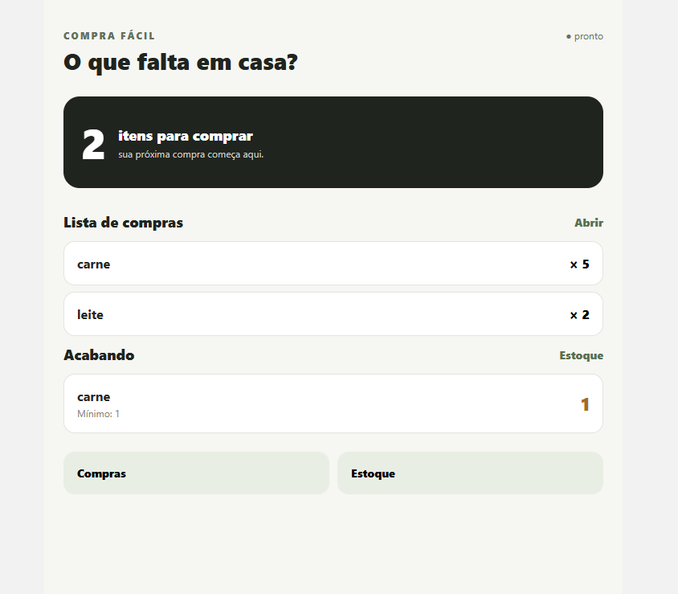
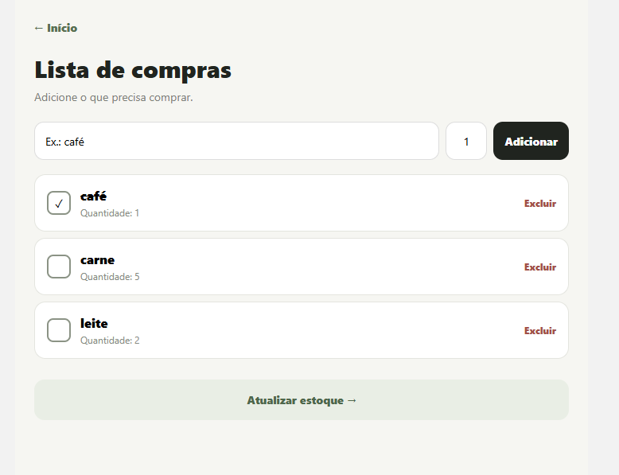
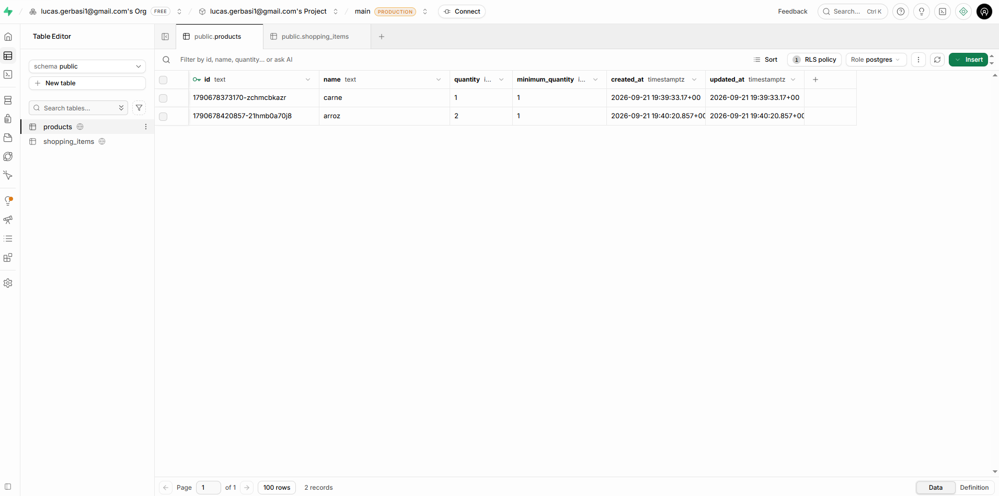
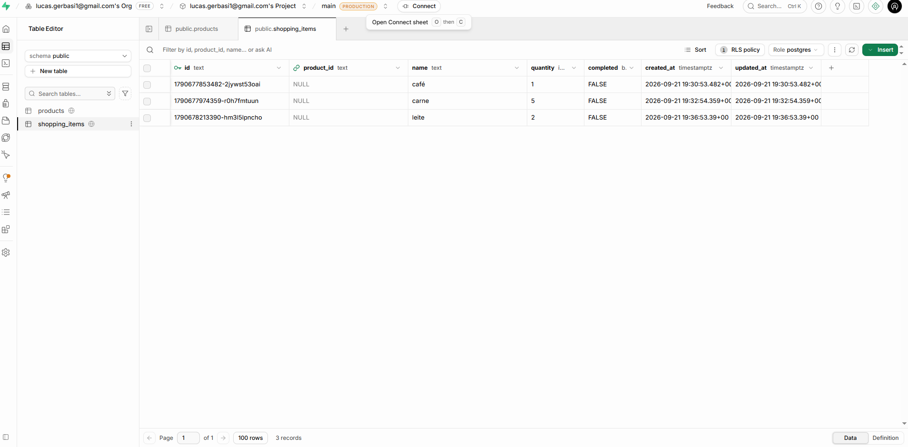

# Compra Fácil

**Problema:** Pessoas esquecem produtos durante as compras, compram itens que já possuem ou percebem tarde demais que algo está acabando.

**Solução:** Uma lista de compras ligada a um estoque doméstico simples. O usuário adiciona o que precisa, marca o que comprou e ajusta a quantidade que tem em casa.

**React Native + Expo:** Expo Router fornece navegação entre Início, Compras, Estoque e cadastro.

**Expo SQLite:** No Android/iOS, `expo-sqlite` cria e persiste as tabelas `products` e `shopping_items`. No web existe uma implementação local equivalente para permitir desenvolvimento no navegador.

**Supabase/PostgreSQL:** `supabase/schema.sql` cria as mesmas entidades no PostgreSQL e o app faz upsert dos dados locais quando as credenciais estão configuradas.

## Telas e Banco de Dados

**Tela Inicial (Dashboard e Alertas):**

**Lista de Compras (Adicionando itens):**

**Persistência Online (Supabase - Tabela products):**

**Persistência Online (Supabase - Tabela shopping_items):**

## Próximos Passos (Bimestre 2)

A câmera será usada para fotografar recibos. OCR/visão computacional extrairá produtos, o usuário confirmará/corrigirá o resultado e o estoque será atualizado. Assim, a visão computacional melhora o fluxo existente em vez de ser uma função desconectada.